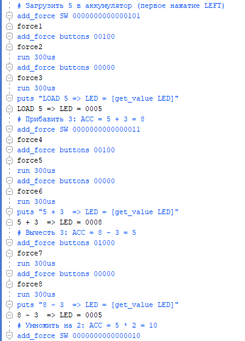

# Calculator — FPGA калькулятор для Nexys A7-100T

Простой калькулятор на SystemVerilog для платы Digilent Nexys A7-100T. Ввод операндов через 16 переключателей (SW), управление — 5 кнопок, результат отображается на 16 светодиодах (LED).

## Архитектура

| Модуль              | Описание                                          |
|---------------------|---------------------------------------------------|
| `calculator_pkg`    | Константы кнопок: UP, DOWN, LEFT, RIGHT, CENTER   |
| `calculator_top`    | Верхний модуль: дебаунс кнопок + инстанс автомата |
| `calculator_mealy`  | Автомат Мили — основная логика вычислений         |
| `tb_calculator_top` | Тестбенч для симуляции                            |

## Управление

Калькулятор работает с 32-битным знаковым аккумулятором. На LED выводятся младшие 16 бит.

| Кнопка   | Индекс | Действие                                         |
|----------|--------|--------------------------------------------------|
| UP       | 0      | `ACC = ACC * SW` (умножение)                     |
| DOWN     | 1      | Сброс: `ACC = 0`, возврат в начальное состояние   |
| LEFT     | 2      | `ACC = ACC + SW` (сложение)                      |
| RIGHT    | 3      | `ACC = ACC - SW` (вычитание)                     |
| CENTER   | 4      | Нет операции (аккумулятор не меняется)            |

**Первое нажатие** (любая кнопка кроме DOWN): загружает значение SW в аккумулятор.

## Запуск симуляции в Vivado

Пример программы через tcl консоль: 

```tcl
restart
# Загрузить 5 в аккумулятор (первое нажатие LEFT)
add_force SW 0000000000000101
add_force buttons 00100
run 300us
add_force buttons 00000
run 300us
puts "LOAD 5 => LED = [get_value LED]"

# Прибавить 3: ACC = 5 + 3 = 8
add_force SW 0000000000000011
add_force buttons 00100
run 300us
add_force buttons 00000
run 300us
puts "5 + 3  => LED = [get_value LED]"

# Вычесть 3: ACC = 8 - 3 = 5
add_force buttons 01000
run 300us
add_force buttons 00000
run 300us
puts "8 - 3  => LED = [get_value LED]"

# Умножить на 2: ACC = 5 * 2 = 10
add_force SW 0000000000000010
add_force buttons 00001
run 300us
add_force buttons 00000
run 300us
puts "5 * 2  => LED = [get_value LED]"

# Сброс (DOWN): ACC = 0
add_force buttons 00010
run 300us
add_force buttons 00000
run 300us
puts "RESET  => LED = [get_value LED]"
```
> `run 300us` нужен для прохождения дебаунса (счётчик 256 тактов при 100 МГц ~ 2.56 мкс, но с запасом берём 300 мкс для наглядности на waveform). Можно использовать меньшие значения, например `run 10us`.


### Скрин выполнения



